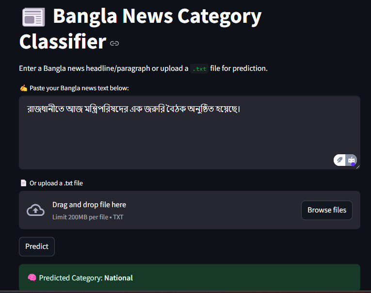

# 📰 Bangla News Category Classifier

A full-stack machine learning project that uses a fine-tuned [BanglaBERT](https://huggingface.co/sagorsarker/bangla-bert-base) model to classify Bangla news texts into four categories:

- **Sports** ⚽
- **International** 🌐
- **Entertainment** 🎬
- **National** 🏛️

This project features:
- ✅ A `FastAPI` backend for serving model inference
- ✅ A `Streamlit` frontend for user interaction
- ✅ A fine-tuned BanglaBERT model for Bangla news classification

---

## 📂 Project Structure
```
BanglaNewsClassification/
│
├── backend/
│   ├── main.py
│   ├── model/
│   │   ├── model_loader.py
│   │   ├── banglabert_category_model.pt
│   │   └── banglabert_tokenizer/
│   └── requirements.txt
│
├── frontend/
│   ├── app.py
│   └── requirements.txt
│
├── notebooks/
│   ├── BanglaNewsClassifier_Training.ipynb
│   └── EDA_and_DataPrep.ipynb
│
├── assets/
│   ├── example_inputs.csv
│   ├── screenshots.png
│   └── style.css
│
├── .gitignore
├── README.md
└── LICENSE  # Optional


```


---

## 🧠 How the Model Was Trained

- **Base Model**: `sagorsarker/bangla-bert-base`
- **Fine-tuned** using a labeled Bangla news dataset with 4 categories.
- **Tokenizer**: BanglaBERT tokenizer
- **Loss Function**: CrossEntropyLoss
- **Optimizer**: AdamW
- **Training Details**:
  - Used early stopping based on validation loss
  - Saved the best model weights to `banglabert_category_model.pt`

---

## 🚀 Getting Started

### 1. Clone the Repository

```
git clone https://github.com/your-username/banglabert-news-classifier.git
cd banglabert-news-classifier
```

### 2. Create and Activate Virtual Environment
```
python -m venv venv
# For Windows
venv\Scripts\activate
# For macOS/Linux
source venv/bin/activate

```

###  3. Setup the Backend (FastAPI)

```
cd backend
pip install -r requirements.txt
uvicorn backcend.main:app --reload

```

### 4. Setup the Frontend (Streamlit)
Open a new terminal tab:

```
cd frontend
pip install -r requirements.txt
streamlit run app.py

```
## 📮 API Endpoint
POST /predict

Request (JSON):

```
{
  "text": "বাংলাদেশ আজ ভারতের বিরুদ্ধে দুর্দান্ত এক জয় পেয়েছে।"
}

```
Response (JSON):

```
{
  "category": "sports"
}

```

## 📌 Example Texts to Try
You can input any Bangla news headline or paragraph. Here are a few examples:
```
আজ বিশ্বজুড়ে পালিত হচ্ছে আন্তর্জাতিক নারী দিবস।
ঢালিউডে নতুন একটি সিনেমার শুটিং শুরু হয়েছে।
রাজধানীতে আজ মন্ত্রিপরিষদের এক জরুরি বৈঠক অনুষ্ঠিত হয়েছে।

```
## 🖼️ Screenshots

### 🔸 Streamlit App UI

## 📦 Dependencies

### 🔙 Backend

The backend requires the following Python libraries:

- `fastapi`
- `uvicorn`
- `torch`
- `transformers`

You can install them with:

```
pip install -r backend/requirements.txt

```

### 🔙 Frontend

The frontend requires the following Python libraries:

- `streamlit`
- `requests`

You can install them with:

```
pip install -r frontend/requirements.txt

```